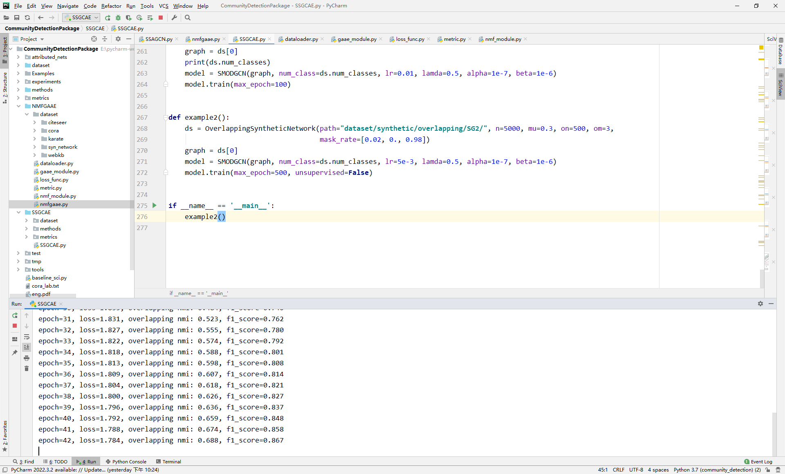

# SSGCN
The code of "Semi-supervised overlapping community detection in attributed graph with graph convolutional autoencoder"

Chaobo He, Yulong Zheng, Junwei Cheng, Yong Tang, Guohua Chen, Hai Liu. Semi-supervised overlapping community detection in attributed graph with graph convolutional autoencoder. Information Sciences, 2022,608:1464-1479.

  

